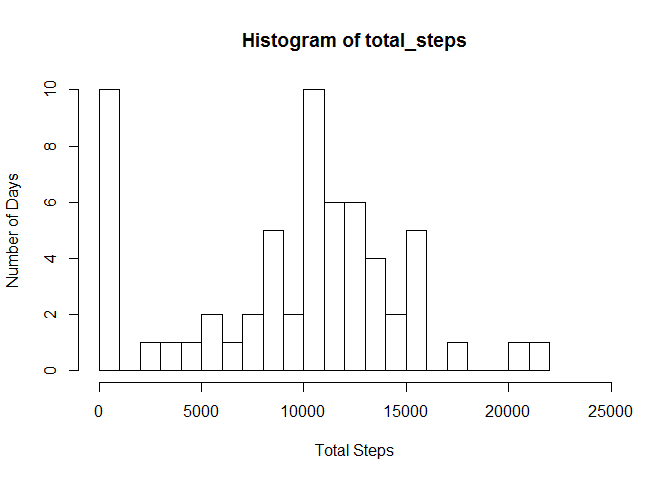
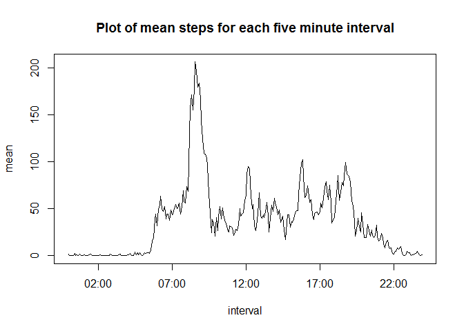
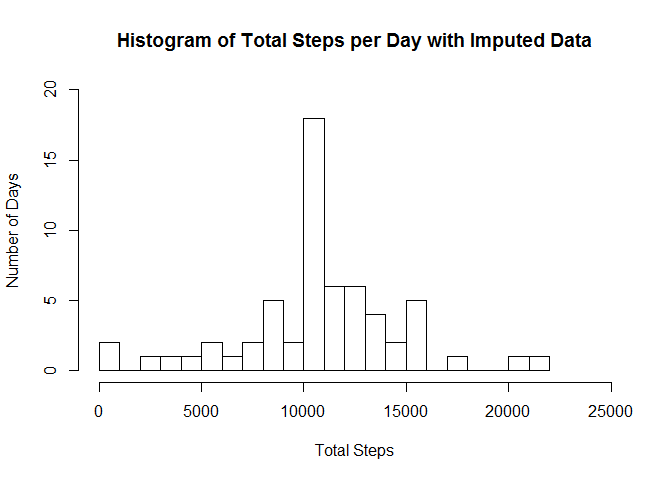
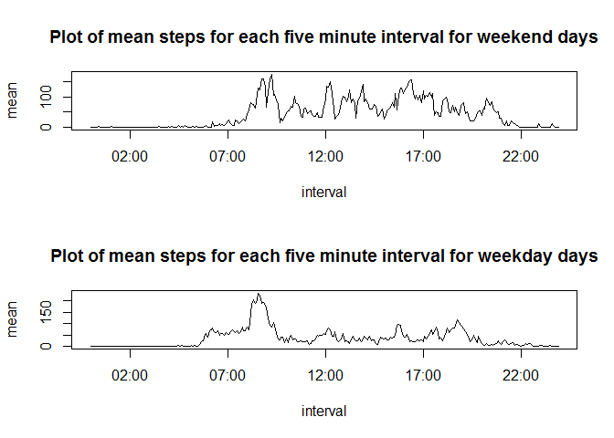

# Reproducible Research: Peer Assessment 1
dwake95  

## Loading and preprocessing the data
### Code to access and unzip the data 
This section assumes that the user has forked the GitHub repository based on the instructions,
thereby having an activity.zip file in the working directory.


```r
if (!file.exists("data")) {
        dir.create("data")
}

if (!file.exists("./data/activity.csv") ) {
        Dataset.zip = tempfile(tmpdir ="./data", fileext=".zip")
        unzip(activity.zip, exdir = "./data")
}
```

You should have 1 file called, "./data/activity.cvs" which contain the raw data

Convert the .csv file to data frame objects


```r
actDat = read.csv("./data/activity.csv", header = TRUE)
```
Get a summary of the data frame columns and their class


```r
str(actDat)
```

```
## 'data.frame':	17568 obs. of  3 variables:
##  $ steps   : int  NA NA NA NA NA NA NA NA NA NA ...
##  $ date    : Factor w/ 61 levels "2012-10-01","2012-10-02",..: 1 1 1 1 1 1 1 1 1 1 ...
##  $ interval: int  0 5 10 15 20 25 30 35 40 45 ...
```

Now it is necessary to modify the interval into a time class


```r
library(lubridate)
actDat$interval <- fast_strptime(sprintf("%04d", actDat$interval), format="%H%M")
```

## What is mean total number of steps taken per day?

### 1. Calculate the total number of steps taken per day


```r
library("dplyr", lib.loc="~/R/win-library/3.1")
```

```
## 
## Attaching package: 'dplyr'
## 
## The following objects are masked from 'package:lubridate':
## 
##     intersect, setdiff, union
## 
## The following object is masked from 'package:stats':
## 
##     filter
## 
## The following objects are masked from 'package:base':
## 
##     intersect, setdiff, setequal, union
```

```r
actDat.date = group_by(actDat, date)
steps.per.day = summarize(actDat.date, total_steps = sum(steps, na.rm=TRUE))
head(steps.per.day)
```

```
## Source: local data frame [6 x 2]
## 
##         date total_steps
## 1 2012-10-01           0
## 2 2012-10-02         126
## 3 2012-10-03       11352
## 4 2012-10-04       12116
## 5 2012-10-05       13294
## 6 2012-10-06       15420
```

### 2. Make a histogram of the total number of steps taken each day


```r
with(steps.per.day, hist(total_steps, breaks = 30, xlab = "Total Steps", 
                         ylab = "Number of Days", xlim = c(0,25000), ylim = c(0,10))
)
```

 

### 3. Calculate and report the mean and median of the total number of steps taken per day


```r
mean.steps = mean(steps.per.day$total_steps, na.rm=TRUE)
print(mean.steps)
```

```
## [1] 9354.23
```

```r
median.steps = median(steps.per.day$total_steps)
print(median.steps)
```

```
## [1] 10395
```

## What is the average daily activity pattern?

### 1. Make a time series plot (i.e. type = "l") of the 5-minute interval (x-axis) and the average number of steps taken, averaged across all days (y-axis)


```r
actDat.int <- group_by(actDat, interval)
steps.per.interval = summarize(actDat.int, mean = mean(steps, na.rm = TRUE))
with(steps.per.interval, plot(mean ~ interval, type = "l", 
                              main = "Plot of mean steps for each five minute interval"))
```

 

### 2. Which 5-minute interval, on average across all the days in the dataset, contains the maximum number of steps?


```r
library("nnet", lib.loc="C:/Program Files/R/R-3.1.2/library")
steps.per.interval$interval = format(steps.per.interval$interval, format = "%H:%M")
steps.per.interval[which.is.max(steps.per.interval$mean),1]
```

```
## Source: local data frame [1 x 1]
## 
##   interval
## 1    08:35
```

## Imputing missing values
Note that there are a number of days/intervals where there are missing values (coded as NA). The presence of missing days may introduce bias into some calculations or summaries of the data.

### 1. Calculate and report the total number of missing values in the dataset (i.e. the total number of rows with NAs)


```r
NAs = !complete.cases(actDat)
sum(NAs)
```

```
## [1] 2304
```

### 2. Devise a strategy for filling in all of the missing values in the dataset. The strategy does not need to be sophisticated. For example, you could use the mean/median for that day, or the mean for that 5-minute interval, etc.

For each NA in the actDat$steps, take the mean steps from the appropriate interval from the steps.per.interval object, and replace the NA with that mean value.

### 3. Create a new dataset that is equal to the original dataset but with the missing data filled in.


```r
actDat.repl = actDat
actDat.repl$interval = format(actDat.repl$interval, format = "%H:%M")
actDat.repl = merge(actDat.repl, steps.per.interval)
actDat.repl$steps[is.na(actDat.repl$steps)] <- actDat.repl$mean[is.na(actDat.repl$steps)]
```

### 4. Make a histogram of the total number of steps taken each day and Calculate and report the mean and median total number of steps taken per day. Do these values differ from the estimates from the first part of the assignment? What is the impact of imputing missing data on the estimates of the total daily number of steps?


```r
actDat.repl.date = group_by(actDat.repl, date)
steps.per.day.repl = summarize(actDat.repl.date, total_steps = sum(steps))
head(steps.per.day.repl)
```

```
## Source: local data frame [6 x 2]
## 
##         date total_steps
## 1 2012-10-01    10766.19
## 2 2012-10-02      126.00
## 3 2012-10-03    11352.00
## 4 2012-10-04    12116.00
## 5 2012-10-05    13294.00
## 6 2012-10-06    15420.00
```

```r
with(steps.per.day.repl, hist(total_steps, breaks = 30, xlab = "Total Steps", ylab =  "Number of Days", main = "Histogram of Total Steps per Day with Imputed Data", xlim = c(0,25000), ylim = c(0,20)))
```

 

The above histogram is very similar to the one without the NA values, however there is definitely a higher peak and less "0-step days".  Similarly, the mean and median have both increased based on the additional data.  

The mean of the steps is calculated below: 


```r
mean.steps.repl = mean(steps.per.day.repl$total_steps)
print(mean.steps.repl)
```

```
## [1] 10766.19
```

The median of the steps is calculated below:


```r
median.steps.repl = median(steps.per.day$total_steps)
print(median.steps.repl)
```

```
## [1] 10395
```

The impact of imputing missing data on the estimates of the total daily number of steps, served to reduce the number of 0-step days, and added 8 days of 10762 steps.  This makes for better coverage of the data, but there may be more investigating to see why data was not collected for these days.  

## Are there differences in activity patterns between weekdays and weekends?

###1. Create a new factor variable in the dataset with two levels - "weekday" and "weekend" indicating whether a given date is a weekday or weekend day.

```r
actDat.days = actDat
actDat.days = mutate(actDat.days, day = weekdays(as.Date(actDat.days$date)))
day <- c("Sunday", "Monday", "Tuesday", "Wednesday", "Thursday", "Friday", "Saturday")
weekend <- c("weekend", "weekday", "weekday", "weekday", "weekday", "weekday", "weekend")
days <- cbind(day, weekend)
days <- as.data.frame(days)  
actDat.days <- merge(actDat.days, days)
actDat.days <- arrange(actDat.days, date, interval)
actDat.days <- arrange(actDat.days, date, interval)
str(actDat.days)
```

```
## 'data.frame':	17568 obs. of  5 variables:
##  $ day     : chr  "Monday" "Monday" "Monday" "Monday" ...
##  $ steps   : int  NA NA NA NA NA NA NA NA NA NA ...
##  $ date    : Factor w/ 61 levels "2012-10-01","2012-10-02",..: 1 1 1 1 1 1 1 1 1 1 ...
##  $ interval: POSIXct, format: "0000-01-01 00:00:00" "0000-01-01 00:05:00" ...
##  $ weekend : Factor w/ 2 levels "weekday","weekend": 1 1 1 1 1 1 1 1 1 1 ...
```

### 2. Make a panel plot containing a time series plot (i.e. type = "l") of the 5-minute interval (x-axis) and the average number of steps taken, averaged across all weekday days or weekend days (y-axis). 


```r
actDat.days <- group_by(actDat.days, weekend, interval)
steps.per.interval.days = summarize(actDat.days, mean = mean(steps, na.rm = TRUE))
weekendDat <- filter(steps.per.interval.days, weekend == "weekend")
weekdayDat <- filter(steps.per.interval.days, weekend == "weekday")

par(mfrow = c(2,1))
with(weekendDat, plot(mean ~ interval, type = "l", 
                              main = "Plot of mean steps for each five minute interval for weekend days"))
with(weekdayDat, plot(mean ~ interval, type = "l", 
                              main = "Plot of mean steps for each five minute interval for weekday days"))
```

 


